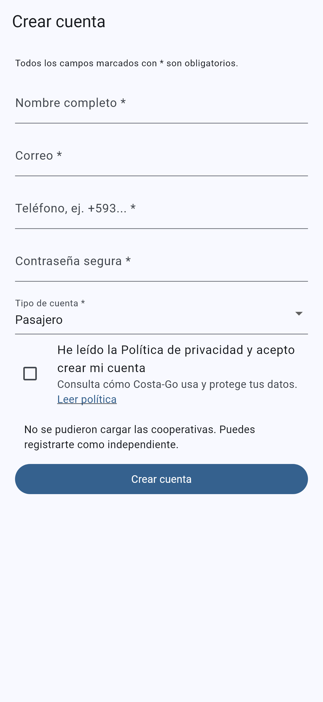
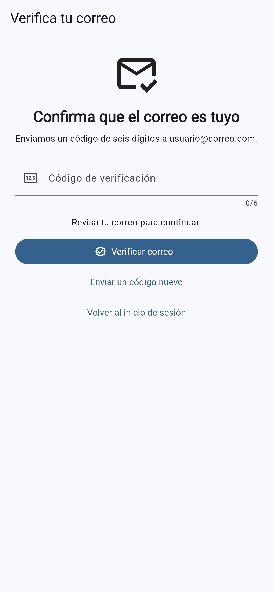
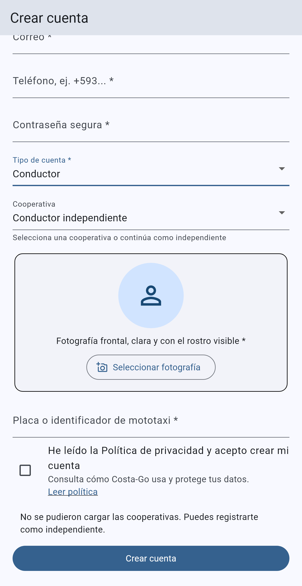

# Costa-Go

## Manual de usuario: creación de cuentas

**Perfiles:** pasajero y conductor

**Versión del manual:** 1.0
**Fecha:** 14 de agosto de 2026

Este manual explica cómo crear y verificar una cuenta en Costa-Go. Los campos marcados con `*` son obligatorios.

## 1. Antes de comenzar

Ten disponible:

- un correo electrónico personal al que puedas acceder;
- un número de teléfono activo;
- una contraseña segura;
- conexión a Internet.

Si vas a registrarte como conductor, también necesitas:

- una fotografía frontal, clara y con el rostro visible;
- placa o identificador de la mototaxi;
- documento de identificación;
- licencia de conducir;
- matrícula de la mototaxi;
- anexos opcionales;
- nombre de la cooperativa, si perteneces a una. También puedes registrarte como conductor independiente.

## 2. Reglas de la contraseña

La contraseña debe:

- tener entre 10 y 100 caracteres;
- incluir al menos una letra mayúscula y una minúscula;
- incluir al menos un número;
- incluir al menos un símbolo, por ejemplo `!`, `@` o `#`;
- no contener espacios.

Ejemplo de estructura segura: una frase privada que combine letras, números y símbolos. No copies contraseñas de ejemplo ni compartas tu contraseña o código de verificación.

## 3. Crear una cuenta de pasajero

1. Abre Costa-Go y pulsa **Crear una cuenta**.
2. Escribe tu **nombre completo**.
3. Ingresa un **correo electrónico válido**. Se utilizará para verificar la cuenta y recuperar la contraseña.
4. Ingresa tu **número de teléfono**. Si corresponde, usa el prefijo de país, por ejemplo `+593`.
5. Crea una contraseña que cumpla las reglas indicadas en este manual.
6. En **Tipo de cuenta**, selecciona **Pasajero**.
7. Lee la Política de privacidad y marca la casilla de aceptación.
8. Pulsa **Crear cuenta**.

## 4. Verificar el correo

Después de crear la cuenta:

1. Revisa la bandeja de entrada del correo registrado.
2. Busca el mensaje enviado por Costa-Go. Si no aparece, revisa **Spam**, **Correo no deseado** o **Promociones**.
3. Escribe en la aplicación el código de seis dígitos.
4. Pulsa **Verificar correo**.
5. Si el código caducó o no llegó, pulsa **Enviar un código nuevo**.

Cuando la verificación termine correctamente, podrás iniciar sesión como pasajero.

## 5. Crear una cuenta de conductor

1. Abre Costa-Go y pulsa **Crear una cuenta**.
2. Completa **nombre**, **correo**, **teléfono** y **contraseña segura**.
3. En **Tipo de cuenta**, selecciona **Conductor**.
4. En **Cooperativa**, elige la cooperativa correspondiente o selecciona **Conductor independiente**.
5. Pulsa **Seleccionar fotografía** y carga una foto frontal, clara y con el rostro visible.
6. Escribe la **placa o identificador de la mototaxi**.
7. Lee la Política de privacidad y marca la casilla de aceptación.
8. Pulsa **Crear cuenta**.
9. Verifica el correo con el código de seis dígitos.

## 6. Documentos y aprobación del conductor

La creación de la cuenta no habilita inmediatamente al conductor para recibir viajes. Debes cargar:

1. fotografía del conductor;
2. documento de identificación;
3. licencia de conducir;
4. matrícula de la mototaxi;
5. anexos (opcionales).

Para imágenes se admiten JPG, JPEG, PNG y WEBP. Los anexos opcionales también pueden cargarse como PDF, DOC o DOCX, con un máximo de 5 MB.

Estados posibles:

- **Completa tus documentos:** falta uno o más archivos obligatorios.
- **Documentos enviados para revisión:** la información está completa y espera revisión administrativa.
- **Se requieren correcciones:** revisa la observación y reemplaza el documento solicitado.
- **Solicitud rechazada:** la solicitud no fue aprobada; revisa la explicación recibida.
- **Aprobado:** ya puedes conectarte como conductor y recibir solicitudes.
- **Cuenta suspendida:** no podrás recibir viajes hasta que administración levante la suspensión.

Costa-Go notificará el resultado de la revisión. Solo un conductor aprobado puede ponerse disponible y aceptar viajes.

## 7. Mensajes frecuentes y solución

### El correo o teléfono ya está registrado

Usa **Recuperar contraseña** si la cuenta es tuya. Un mismo usuario puede utilizar los perfiles de pasajero y conductor dentro de su cuenta cuando complete la habilitación correspondiente; no debe crear cuentas duplicadas.

### La contraseña es rechazada

Comprueba longitud, mayúsculas, minúsculas, número, símbolo y ausencia de espacios.

### No llega el código de verificación

Confirma que el correo esté bien escrito, revisa Spam y pulsa **Enviar un código nuevo**. Utiliza siempre el código más reciente.

### El conductor no puede recibir viajes

Revisa el estado de habilitación. Puede faltar documentación, existir una observación o estar pendiente la aprobación.

### La foto o documento no carga

Verifica el formato, el tamaño y la conexión. La fotografía debe ser clara y permitir identificar el rostro.

## 8. Seguridad y privacidad

- No compartas la contraseña ni los códigos recibidos por correo.
- Verifica que el correo y el teléfono sean tuyos.
- Cierra sesión si utilizas un equipo que no te pertenece.
- Si olvidas la contraseña, utiliza **Recuperar contraseña** desde el inicio de sesión.
- Consulta la Política de privacidad: https://costa-go.com/privacy.html
- Consulta los Términos y condiciones: https://costa-go.com/terms.html

## 9. Ayuda

Dentro de la aplicación abre **Mi cuenta → Ayuda y soporte** para consultar preguntas frecuentes o crear una solicitud de soporte.

Al solicitar ayuda, indica:

- el correo de la cuenta;
- si el perfil es pasajero o conductor;
- el mensaje mostrado por la aplicación;
- una captura de pantalla, sin exponer contraseñas ni códigos.

---

**Costa-Go — Tu viaje, nuestra prioridad.**
